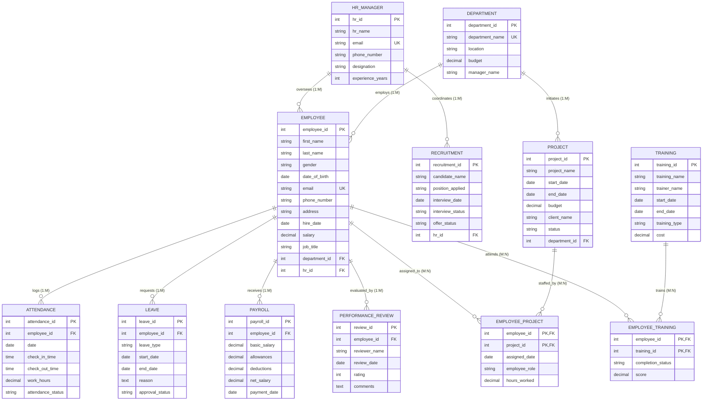

# Enhanced Entity-Relationship (EER) Model Documentation

This document describes the conceptual and logical architecture of the **Employee & HR Management System**, translating the EER diagram directly into relational database specifications.

---

## 1. System EER Architecture Diagram (Mermaid)

---

## 2. Generalization / Specialization Hierarchy

In the EER conceptual model:
- **Superclass**: `HR_PERSON`
  - Attributes: `HR_ID`, `Name`, `Email`, `Phone`, `Designation`
- **Subclasses**:
  - `HR_MANAGER`: Focuses on organizational governance, experience level, department alignment.
  - `RECRUITMENT_OFFICER`: Focuses on applicant sourcing, interview tracking, and hiring quotas.

### Relational Mapping Choice:
To maximize performance and eliminate unnecessary outer joins for transactional HR queries, this hierarchy is represented via the **`HR_MANAGER`** entity acting as the core HR authority, coupled with foreign key associations into the `RECRUITMENT` entity (`HR_ID` FK).

---

## 3. Cardinalities and Referential Integrity Rules

| Parent Entity | Child Entity | Cardinality | FK Constraint | Delete Rule | Update Rule |
|---|---|---|---|---|---|
| `DEPARTMENT` | `EMPLOYEE` | 1 : M | `department_id` | `RESTRICT` | `CASCADE` |
| `HR_MANAGER` | `EMPLOYEE` | 1 : M | `hr_id` | `RESTRICT` | `CASCADE` |
| `DEPARTMENT` | `PROJECT` | 1 : M | `department_id` | `RESTRICT` | `CASCADE` |
| `EMPLOYEE` | `ATTENDANCE` | 1 : M | `employee_id` | `CASCADE` | `CASCADE` |
| `EMPLOYEE` | `LEAVE` | 1 : M | `employee_id` | `CASCADE` | `CASCADE` |
| `EMPLOYEE` | `PAYROLL` | 1 : M | `employee_id` | `CASCADE` | `CASCADE` |
| `EMPLOYEE` | `PERFORMANCE_REVIEW` | 1 : M | `employee_id` | `CASCADE` | `CASCADE` |
| `HR_MANAGER` | `RECRUITMENT` | 1 : M | `hr_id` | `RESTRICT` | `CASCADE` |
| `EMPLOYEE` & `PROJECT` | `EMPLOYEE_PROJECT` | M : N | `(employee_id, project_id)` | `CASCADE` | `CASCADE` |
| `EMPLOYEE` & `TRAINING` | `EMPLOYEE_TRAINING` | M : N | `(employee_id, training_id)` | `CASCADE` | `CASCADE` |

- **Delete Rule Justification**:
  - Operational logs (`attendance`, `leave`, `payroll`, `reviews`) are tied directly to an employee's lifecycle and cascade when an employee record is expunged.
  - Organizational units (`department`, `hr_manager`) use `RESTRICT` so that departments cannot be accidentally purged while employees or projects remain assigned to them.
